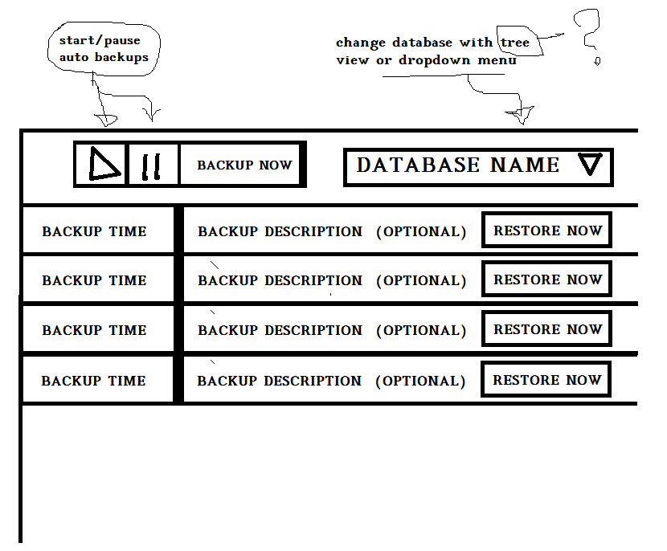

# mysql-pokedex
DB administration tool to manage and restore MySQL database like a VCR. 

## MVP Features

- single db mode, using the first database of `db.json`
- list of backups in the proper backup folder
   - buttons for: restore | delete | download

- button for manual backup of database
- a button to delete rows(backups)

- manual configuration array of database entries in a `database.json` file
    - server definition: server/port/user/pass
    - user name + password  (must have proper rights granted)
    - amount of time (sec) between each backup: 0=disabled
    - max age: after backup delete files older than value (timestamp in file name)

### Planned Features

- overview of all tracked databases

- periodic backup using a cron job service (`* * * * *`)
  - user can activate/suspend the setting in gui

- allow a command line usage too
   - e.g. `php restore.php db_name`

- `databases.json` contains all database databases with their own settings (originally inherited from a global `template.json`)
     - backup retention time / amount
     - backup interval time / temporal resolution
     - ~ compression
     - ~ incremental backups if schema is unchanged
        - would be an sql file of the statements needed to end up with the last db (todo: find an sql diff tool)

- setup credential sets in `users.json`
   - user/pass/server/port
   - a specific datbase or detect all available

- a GUI to edit a `database.json` file   

- introduce a `/public` folder model or make a proper htaccess file / set permissions to ensure the json files are kept private.

- some way to start/synchronize/abort database operations (mysql in memory table or sqlite or php session)
   - a list of operations with flow controls (pause, abort) and other details (target, operation, E.T.A)

## Screeshots
Mockup of main view. I should really get some device with pen input...

## License
Refer to the LICENSE file for the specifics of GPL3.

## Helping
This project is still in alpha. Any help is appreciated, tough.